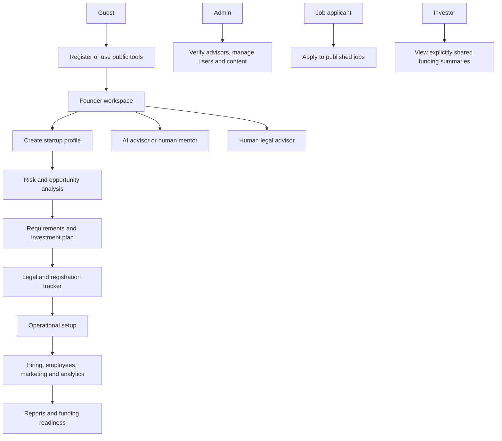
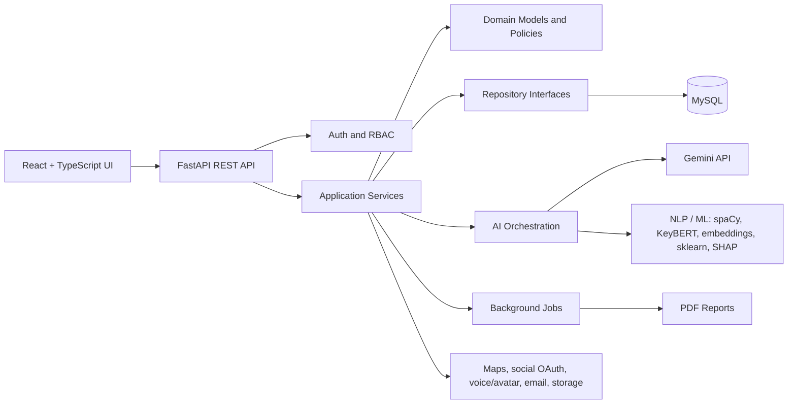
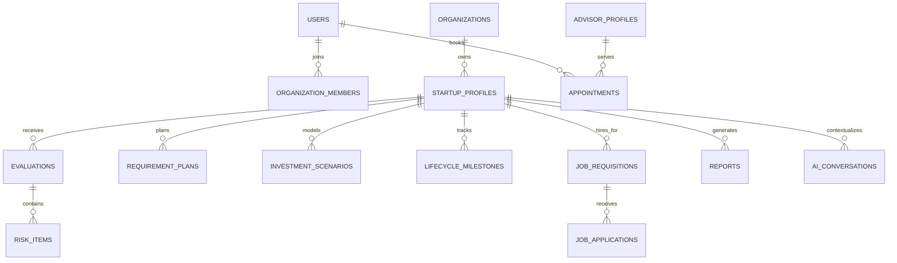
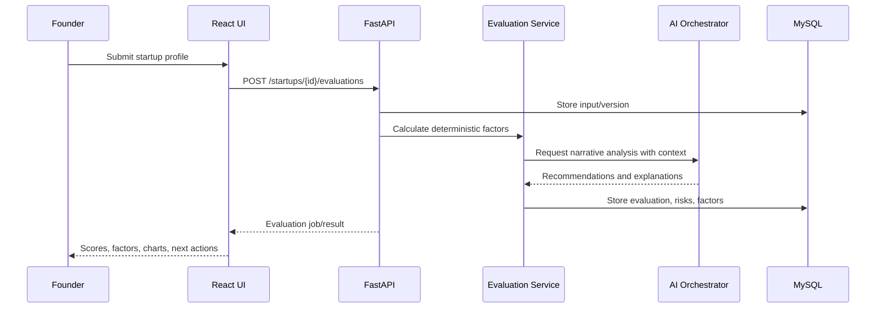

# VentureMind AI - Software Requirements Specification and Architecture

## 1. Purpose and scope

VentureMind AI is a local-first Startup Lifecycle Management System. It supports a founder from idea discovery through validation, planning, registration, operation, hiring, analytics, and reporting. It is a decision-support product: it identifies assumptions, risks, evidence gaps, and next actions; it does not guarantee business success, legal compliance, funding, or profitability.

### Objectives

- Capture a structured startup profile and operating plan.
- Produce explainable, repeatable risk and confidence evaluations.
- Support founder planning: requirements, investments, milestones, legal checklists, hiring, and reports.
- Provide separate role experiences for founders, administrators, legal advisors, mentors, applicants, and investors.
- Run locally with React, FastAPI, MySQL, Docker, and environment variables.

### Existing foundation to preserve

The current workspace already includes public landing pages, rapid validation, idea generation, calculators, editable templates, resource pages, books, stories, a FastAPI foundation, data models, authentication scaffolding, evaluation services, reporting, chat, and an admin workspace. The lifecycle modules below extend those features rather than replace or duplicate them.

## 2. Actors and access control

| Actor | Main permissions |
|---|---|
| Guest | Browse public resources; use guest tools; register/login. |
| Startup Founder | Own startup profiles, projects, plans, risks, reports, tasks, hires, and consultations. |
| Admin | Manage users, advisor verification, content, feedback, platform metrics, and moderation. |
| Human Legal Advisor | Maintain profile, availability, specialties, appointments, consultation notes, and documents for assigned clients. |
| Business Mentor | Maintain profile, availability, consultation notes, recommendations, and assigned founders. |
| Job Applicant | Create profile, apply to published startup jobs, upload resume, view application status. |
| Investor | Optional verified role; view founder-shared investor-ready summaries and funding requests only. |

RBAC is enforced by JWT claims, API dependencies, ownership checks, and database relationships. A founder may only access their own organization unless explicitly sharing a record.

## 3. Functional requirements

### FR-01 Startup profile and idea submission

The founder can create an organization and startup profile containing business name, category, description, target customers, country, district, city, planned investment, available budget, experience, goals, industry, size, startup type, partners, employees, and timeline. Profiles support drafts, version history, attachments, and consent settings.

### FR-02 Explainable risk analysis

The system evaluates market, financial, competition, customer, supply-chain, technology, political, economic, climate, disaster, legal, location, operations, scalability, and HR risk. For every result it stores score, priority, factor evidence, confidence, assumptions, recommendations, timestamp, model/version, and human override when applicable.

### FR-03 Competitor and location analysis

The founder may search a category and location. The system can store manually entered competitors and, when a map/data provider is configured, import nearby public business results. It compares features, pricing notes, reviews, ratings, strengths, weaknesses, SWOT, market position, gaps, and opportunities. Provider-derived data must retain source, retrieval time, and licence/attribution metadata.

### FR-04 Business requirement planning

The system generates an editable checklist grouped by premises, utilities, equipment, staff, licences, technology, delivery, marketing, branding, insurance, and launch readiness. Requirements have cost, owner, status, dependency, due date, evidence attachment, and completion percentage.

### FR-05 Investment planning

The founder can compare single-owner and multi-partner scenarios. The system calculates capital contribution, startup costs, monthly expenses, salaries, cash flow, emergency reserve, ROI, break-even, funding need, and partner ownership assumptions. All formula outputs display their inputs and formula version.

### FR-06 AI business advisor and mentor

The AI advisor uses a Gemini-compatible provider with project-scoped context, conversation history, safety rules, citations to stored facts where possible, prompt/version audit logs, and user feedback. The optional avatar and voice layer is an integration boundary: avatar images and speech-to-text/text-to-speech require separately configured providers.

### FR-07 Legal guidance

Country-specific guidance is represented as versioned, source-linked legal content. Sri Lanka is the first target profile. Guidance includes business types, registration steps, departments, municipal approvals, tax/licence/health checklists, forms, offices, fees, and source links. It must show a legal disclaimer and review date.

### FR-08 Human legal advisor marketplace

Advisors submit verification details. Admin approval is required before public listing. Founders can browse, filter, request appointments, select online/physical consultation, upload permitted documents, and receive consultation notes. Payment is a future integration unless a compliant payment provider is configured.

### FR-09 Business registration tracker

Founders manage lifecycle milestones: idea, risk analysis, registration, tax, licence, branding, website, hiring, marketing, opening, and operation. Milestones use weighted completion, evidence links, due dates, owners, and alerts.

### FR-10 Hiring management

Founders create job requisitions. AI may draft job descriptions, requirements, responsibilities, salary ranges, interview questions, offer-letter drafts, and job posts; a human must review before publishing.

### FR-11 Poster generator

Users create editable, exportable marketing assets from safe templates for hiring, launch, discounts, social posts, flyers, and business cards. Initial implementation is template/canvas based; image generation is optional and must be clearly labelled as AI-generated.

### FR-12 Social publishing

Users connect authorized Facebook, Instagram, LinkedIn, and WhatsApp Business accounts through official OAuth/API integrations. The system supports post drafts, media, scheduling, publishing status, failures, and audit logs. No platform may be simulated as published without a confirmed provider response.

### FR-13 Resume builder

Applicants create ATS-friendly resumes, cover letters, and portfolios, export PDF, and choose which versions to share per application.

### FR-14 Interview assistant

Hiring teams generate role-specific question banks, evaluation sheets, scoring rubrics, feedback, and candidate ranking explanations. Rankings must be reviewable and cannot make automated final hiring decisions.

### FR-15 Employee management

Founders manage employee profiles, attendance, leave, payroll inputs, performance reviews, training, tasks, and announcements. Salary payments and biometric attendance are future integrations.

### FR-16 AI mentor

The mentor delivers contextual recommendations for marketing, finance, sales, pricing, branding, growth, customer issues, expansion, risk reduction, and funding. Advice is scoped to the founder's selected startup and may be escalated to a human mentor.

### FR-17 Funding readiness

The system measures investor, business, pitch, and financial readiness, then produces a traceable funding-readiness score with evidence gaps, investor-data-sharing controls, and recommended next actions.

### FR-18 Analytics dashboard

The dashboard displays founder-entered or integrated revenue, expenses, profit, customers, employees, progress, risk trends, KPIs, and forecast assumptions. All financial charts identify the selected date range and data source.

### FR-19 Recommendation engine

The engine prioritizes actions such as cost reduction, hiring, marketing, pricing, expansion, customer service, website launch, and risk reduction. Recommendations include rationale, priority, expected evidence, due date, status, and user feedback.

### FR-20 Business report generator

The system produces versioned PDF reports for business plan, SWOT, PESTLE, competitor analysis, risk analysis, investment plan, marketing plan, financial plan, hiring plan, and legal checklist. Reports include generated-on date, assumptions, source references, and disclaimer.

## 4. Non-functional requirements

| Area | Requirement |
|---|---|
| Security | JWT access/refresh tokens, password hashing, RBAC, ownership checks, upload validation, audit logging, secret storage in `.env`. |
| Privacy | Consent for advisor/investor sharing, data minimization, downloadable/deletable personal data, document access controls. |
| Reliability | Consistent API error envelope, retries for external providers, background-job status, idempotent publishing/webhook handling. |
| Performance | Paginated APIs, indexed foreign keys, asynchronous report/AI tasks, cache static legal/resource data. |
| Maintainability | Clean Architecture, SOLID, typed DTOs, reusable frontend components, service interfaces, migrations, test suites. |
| Accessibility | Keyboard navigation, semantic labels, colour contrast, responsive layouts, readable charts/tables. |
| Observability | Structured logs, request IDs, audit events, external API usage metrics, error tracking hooks. |
| Local-first | Docker Compose for API, MySQL, worker, and frontend; local `.env` configuration and Swagger documentation. |

## 5. Use cases and user flow



## 6. System architecture



### Clean Architecture boundaries

- **Presentation:** React pages/components and FastAPI routers.
- **Application:** use cases, DTOs, orchestration, authorization policies.
- **Domain:** entities, value objects, rules, score formulas, lifecycle policies.
- **Infrastructure:** SQLAlchemy repositories, Gemini client, email, storage, social APIs, maps, PDF renderer.

## 7. Database design

### Identity and governance

`users`, `roles`, `user_roles`, `refresh_tokens`, `email_verifications`, `password_resets`, `audit_logs`, `notifications`, `consents`, `file_assets`.

### Startup lifecycle

`organizations`, `organization_members`, `startup_profiles`, `startup_profile_versions`, `startup_goals`, `startup_locations`, `projects`, `startup_attachments`, `lifecycle_milestones`, `milestone_evidence`, `tasks`, `task_comments`.

### Analysis and planning

`evaluations`, `evaluation_dimensions`, `evaluation_factors`, `risk_assessments`, `risk_items`, `risk_recommendations`, `competitor_searches`, `competitors`, `competitor_observations`, `swot_items`, `requirement_plans`, `requirements`, `investment_scenarios`, `investment_line_items`, `financial_assumptions`, `financial_forecasts`, `funding_readiness_assessments`, `recommendations`.

### Legal and advisory

`jurisdictions`, `legal_guides`, `legal_guide_steps`, `legal_forms`, `advisor_profiles`, `advisor_verifications`, `advisor_availability`, `appointments`, `consultations`, `consultation_notes`, `consultation_documents`, `mentor_profiles`.

### Hiring and operations

`job_requisitions`, `job_posts`, `job_applications`, `applicant_profiles`, `resumes`, `cover_letters`, `interview_plans`, `interview_questions`, `interview_evaluations`, `employees`, `attendance_records`, `leave_requests`, `payroll_periods`, `performance_reviews`, `training_records`, `announcements`.

### Marketing and publishing

`brand_assets`, `poster_templates`, `poster_projects`, `social_accounts`, `social_posts`, `social_post_media`, `social_publications`, `social_publish_attempts`.

### AI, reports, and analytics

`ai_conversations`, `ai_messages`, `ai_usage_logs`, `ai_prompt_versions`, `reports`, `report_versions`, `metric_definitions`, `metric_values`, `dashboard_snapshots`.

### Key relationships



## 8. Frontend structure

```text
frontend/src/
  app/                 # providers, router, app bootstrap
  components/          # reusable UI, charts, forms, layout
  features/
    auth/ startups/ risk/ competitors/ requirements/ investment/
    legal/ advisors/ lifecycle/ hiring/ employees/ marketing/
    social/ resumes/ interviews/ mentor/ funding/ analytics/ reports/
  pages/               # public and role landing pages
  services/            # Axios clients and typed API adapters
  hooks/ config/ types/ utils/
```

## 9. Backend structure

```text
backend/app/
  api/v1/endpoints/    # REST routers
  core/                # config, security, logging, errors
  domain/              # entities, policies, score rules
  schemas/             # Pydantic request/response DTOs
  services/            # application use cases
  repositories/        # repository interfaces and implementations
  models/              # SQLAlchemy persistence models
  ai/                  # Gemini, NLP, ML, prompts, explainability
  integrations/        # maps, social, email, storage, voice/avatar
  workers/             # async jobs and scheduled tasks
  reports/             # PDF/report composition
  tests/
```

## 10. API groups

| Group | Example endpoints |
|---|---|
| Auth | `POST /auth/register`, `POST /auth/login`, `POST /auth/refresh`, `POST /auth/logout`, `POST /auth/forgot-password` |
| Startups | `GET/POST /startups`, `GET/PATCH /startups/{id}`, `POST /startups/{id}/submit` |
| Risk | `POST /startups/{id}/evaluations`, `GET /evaluations/{id}`, `GET /evaluations/{id}/risks` |
| Competitors | `POST /startups/{id}/competitor-searches`, `GET/POST /startups/{id}/competitors` |
| Planning | `GET/POST /startups/{id}/requirements`, `GET/POST /startups/{id}/investment-scenarios` |
| Legal | `GET /legal-guides`, `GET /legal-guides/{country}`, `GET/POST /appointments` |
| Hiring | `CRUD /jobs`, `POST /jobs/{id}/applications`, `POST /jobs/{id}/interview-plans` |
| Operations | `CRUD /employees`, `/attendance`, `/leave-requests`, `/performance-reviews` |
| Marketing | `CRUD /poster-projects`, `CRUD /social-posts`, `POST /social-posts/{id}/publish` |
| AI | `POST /ai/conversations`, `POST /ai/conversations/{id}/messages`, `GET /ai/usage` |
| Analytics | `GET /startups/{id}/dashboard`, `GET /startups/{id}/metrics` |
| Reports | `POST /startups/{id}/reports`, `GET /reports/{id}/download` |
| Admin | `/admin/users`, `/admin/advisors`, `/admin/content`, `/admin/analytics` |

## 11. Dashboard and page design

- **Founder dashboard:** startup health card, risk trend, lifecycle progress, cash/runway, next actions, mentor messages, upcoming appointments.
- **Startup workspace:** tabs for Profile, Analysis, Competitors, Requirements, Investment, Legal, Milestones, Hiring, Operations, Marketing, Analytics, Reports.
- **Advisor workspace:** calendar, pending requests, assigned startups, secure documents, consultation notes.
- **Admin dashboard:** users/roles, advisor verification queue, platform/AI usage, feedback, audit events.
- **Applicant workspace:** profile, resumes, applied jobs, interview status.
- **Investor workspace:** only founder-shared summaries, funding readiness, documents, and contact requests.

## 12. AI architecture and safety

1. Input validation and PII minimization.
2. NLP extraction using spaCy/KeyBERT/Sentence Transformers.
3. Deterministic evaluation and financial formulas for measurable results.
4. Gemini prompting with selected startup context and policy prompts.
5. Explainability output: factors, assumptions, source values, confidence, and suggestions.
6. Human-review boundaries for legal advice, hiring decisions, funding decisions, and financial advice.
7. Usage logs, prompt versions, feedback, rate limits, and graceful fallback when the provider is unavailable.

## 13. UML sequence: full evaluation



## 14. Development roadmap and milestones

| Phase | Deliverable | Status |
|---|---|---|
| 0 | SRS, architecture, database, APIs, UML, roadmap | Current documentation phase |
| 1 | Core accounts, RBAC, organization/startup profile, lifecycle tracker | Next build phase |
| 2 | Explainable risk analysis, competitor workflow, requirements, investments | Planned |
| 3 | Legal guidance, advisor marketplace, appointments, documents | Planned |
| 4 | Hiring, resumes, interviews, employee management | Planned |
| 5 | Posters, social drafts, approved publishing integrations | Planned |
| 6 | Mentor/avatar/voice integration, funding readiness, analytics, reports | Planned |
| 7 | Security hardening, tests, Docker, demo data, final presentation | Planned |

### Suggested two-week sprints

- **Sprint 1:** audit current code, migrate organization/role/startup schema, profile wizard, RBAC tests.
- **Sprint 2:** risk taxonomy, deterministic risk service, factor explanations, lifecycle tracker.
- **Sprint 3:** competitor manual workflow, requirement planner, investment scenarios.
- **Sprint 4:** Sri Lanka legal content model and advisor verification/appointment MVP.
- **Sprint 5:** jobs, applicants, resumes, interviews, employees MVP.
- **Sprint 6:** poster templates, social draft calendar, provider integration interfaces.
- **Sprint 7:** AI mentor context, funding readiness, analytics, reports.
- **Sprint 8:** end-to-end tests, security review, Docker Compose, documentation, supervisor demo.

## 15. External dependencies and honest limitations

| Capability | Required dependency before claiming it is live |
|---|---|
| Nearby real competitors | Licensed Maps/Places provider, key, attribution, and data-retention policy. |
| Social publishing | Official Meta, LinkedIn, and WhatsApp Business apps, OAuth approval, tokens, webhooks, and platform review. |
| Voice/avatar advisor | Speech-to-text, text-to-speech, and avatar provider with consent and cost controls. |
| Country legal guidance | Maintained official sources and review by qualified legal professionals. |
| Human legal advice | Advisor identity/qualification verification, appointment/privacy policy, secure document storage. |
| Payments | Approved payment provider, compliance, refunds, invoices, and audit trails. |

## 16. Definition of done for each implementation module

Every module is complete only when it has: database migration, domain/service layer, validated APIs, RBAC/ownership checks, frontend page and states, error/loading/empty handling, audit/logging where required, unit/integration tests, responsive preview, and documentation update. External integrations additionally require a real provider response; a mock is labelled as demo-only.
